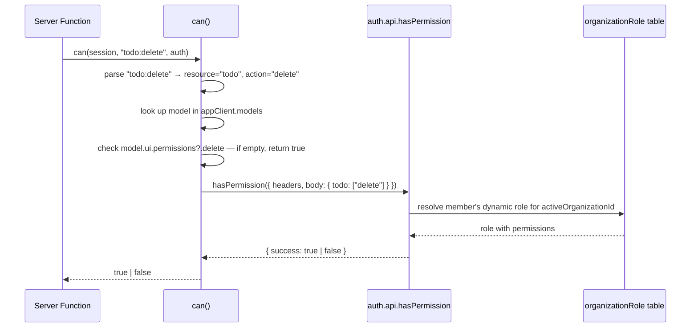

# Design Document: Dynamic Permission System

## Overview

This design replaces the custom `rolesTable` / `userRolesTable` schema and the `createPermissionsAdapter` indirection in `packages/tanstack-use-permissions` with Better Auth's native `organization` plugin configured for dynamic access control.

The core idea is straightforward: instead of maintaining a parallel role-lookup database and a custom adapter that bridges it to the permission guard, we generate permission strings directly from the model registry (`appClient.models`) and hand them to Better Auth's `createAccessControl` / `organization()` machinery. Better Auth then owns all role and permission storage in its `organizationRole` table, and the `can()` guard simply calls `auth.api.hasPermission` to evaluate any check.

The public API surface — `can(session, target, auth)`, `AuthorizationError`, and `createAuthRoute` — does not change. Existing call sites require no modification.

### Key Research Findings

Better Auth's `organization` plugin with `dynamicAccessControl: { enabled: true }` ([docs](https://better-auth.com/docs/plugins/organization)):

- Requires a pre-defined `ac` instance built via `createAccessControl(statement)` from `better-auth/plugins/access`. The statement is a plain object mapping resource names to arrays of action strings (e.g. `{ post: ["create", "read", "update", "delete"] }`).
- Stores dynamic roles in an `organizationRole` table. Roles are created at runtime via `auth.api.createOrgRole` (server) or `authClient.organization.createRole` (client).
- Exposes `auth.api.hasPermission({ headers, body: { permissions: { [resource]: [action] } } })` for server-side checks. This resolves the session's active organization and the member's dynamic role, then evaluates against the AC instance.
- `authClient.organization.checkRolePermission` does **not** resolve dynamic roles — only `hasPermission` does.
- The `organizationClient()` client plugin must also receive `dynamicAccessControl: { enabled: true }` to enable client-side helpers.
- A migration is required to add the `organizationRole` table when dynamic access control is first enabled.

---

## Architecture

The change touches three layers:

1. **Permission generation** (`packages/tanstack-use-permissions/src/permission-generator.ts` — new file): iterates `appClient.models` and produces the `ac` statement and `AccessControl` instance.
2. **Auth server configuration** (`packages/tanstack-use-core/src/auth.ts`): consumes the `ac` instance and enables `dynamicAccessControl`.
3. **Permission guard** (`packages/tanstack-use-permissions/src/permission-guard.ts`): replaces the custom DB lookup with a call to `auth.api.hasPermission`.

```mermaid
graph TD
    A[appClient.models<br/>Map&lt;string, Model&gt;] -->|generatePermissions| B[statement object<br/>{ post: ['create','read',...] }]
    B -->|buildAc| C[AC_Instance<br/>createAccessControl]
    C -->|ac option| D[organization plugin<br/>dynamicAccessControl: enabled]
    D -->|part of| E[Auth_Server<br/>betterAuth]
    E -->|auth.api.hasPermission| F[Permission_Guard<br/>can()]
    F -->|true / false| G[Server Function / Route]
```

### Data Flow for a Permission Check



---

## Components and Interfaces

### 1. `permission-generator.ts` (new)

Responsible for converting the model registry into a Better Auth AC instance.

```typescript
import { createAccessControl } from "better-auth/plugins/access";
import type { PgTable } from "drizzle-orm/pg-core";
import type { Model } from "@tanstack-use/core";

const CRUD_ACTIONS = ["create", "read", "update", "delete"] as const;
type CrudAction = (typeof CRUD_ACTIONS)[number];

/**
 * Converts the model registry into a Better Auth AC statement object.
 * Each model name becomes a resource key with the four CRUD actions.
 *
 * @example
 * // models has "todos" and "posts"
 * generatePermissions(models)
 * // → { todos: ["create","read","update","delete"], posts: [...] }
 */
export function generatePermissions(
  models: Map<string, Model<PgTable>>,
): Record<string, readonly CrudAction[]> {
  const statement: Record<string, readonly CrudAction[]> = {};
  for (const name of models.keys()) {
    statement[name] = CRUD_ACTIONS;
  }
  return statement;
}

/**
 * Builds a Better Auth AccessControl instance from the model registry.
 * The returned instance is passed as the `ac` option to `organization()`.
 */
export function buildAc(models: Map<string, Model<PgTable>>) {
  const statement = generatePermissions(models);
  return createAccessControl(statement as Parameters<typeof createAccessControl>[0]);
}
```

**Design decision**: `CRUD_ACTIONS` is defined as a `const` tuple so TypeScript can infer the literal union type required by `createAccessControl`. The statement is cast at the call site because the generic inference of `createAccessControl` requires `as const` on the literal — since we build the object dynamically we use a type assertion.

### 2. `auth.ts` (modified — `packages/tanstack-use-core/src/auth.ts`)

The `getAuthConfig` function is updated to call `buildAc` with the current model registry and pass the result to `organization()`.

```typescript
import { buildAc } from "@tanstack-use/permissions/permission-generator";
import { appClient } from "./client.js";

const getAuthConfig = (db: NodePgDatabase) => ({
  database: drizzleAdapter(db, { provider: "pg", schema: authSchema }),
  emailAndPassword: { enabled: true },
  plugins: [
    organization({
      ac: buildAc(appClient.models),
      dynamicAccessControl: { enabled: true },
    }),
    admin(),
    tanstackStartCookies(),
  ] as const,
} satisfies BetterAuthOptions);
```

**Design decision**: `buildAc` is called at config-construction time (inside `getAuthConfig`), which is called once during `createAuth(db)`. At that point `appClient.models` is already populated by `defineApp()`. The call order in application startup is: `defineApp()` → `createAuth(db)` (inside `appServer`). This is already the existing order in `server.ts`.

**Circular dependency note**: `auth.ts` (in `@tanstack-use/core`) importing from `@tanstack-use/permissions` would create a circular dependency since `permissions` already depends on `core`. To avoid this, `permission-generator.ts` is placed in `packages/tanstack-use-core/src/` rather than in `packages/tanstack-use-permissions/src/`. It is exported from `@tanstack-use/core` and consumed by both `auth.ts` and `permission-guard.ts`.

### 3. `permission-guard.ts` (modified)

The `can()` function is rewritten to delegate to `auth.api.hasPermission` instead of calling `getActiveMemberGroups`.

```typescript
import { appClient } from "@tanstack-use/core";
import type { Session } from "@tanstack-use/core/server";
import type { AuthInstance } from "@tanstack-use/core/auth";

export async function can(
  session: Session,
  target: string,
  auth?: AuthInstance,
): Promise<boolean> {
  const colonIndex = target.indexOf(":");
  if (colonIndex === -1) {
    throw new Error(`Invalid permission target: "${target}". Expected format: "<model>:<operation>"`);
  }

  const modelName = target.slice(0, colonIndex);
  const operation = target.slice(colonIndex + 1);

  const model = appClient.models.get(modelName);
  if (model === undefined) {
    throw new Error(`Unknown model: "${modelName}"`);
  }

  const allowedRoles: string[] =
    model.ui.permissions?.[operation as keyof typeof model.ui.permissions] ?? [];

  // Empty or absent permission array means unrestricted access
  if (allowedRoles.length === 0) {
    return true;
  }

  if (!auth) {
    return false;
  }

  const result = await auth.api.hasPermission({
    headers: (session as unknown as { headers?: Headers }).headers ?? new Headers(),
    body: {
      permissions: { [modelName]: [operation] },
    },
  });

  return result.success === true;
}
```

**Design decision on separator**: The requirements specify `:` as the separator (e.g. `todo:delete`). The existing code uses `.` (e.g. `employee.read`). The new implementation uses `:` to match the requirements and Better Auth's own permission string convention. Existing call sites that use `.` will need to be updated — this is a deliberate breaking change within the internal call sites (not the public `can` signature itself).

**Design decision on headers**: `auth.api.hasPermission` needs the request headers to resolve the session cookie. The `Session` type from Better Auth includes the session data but not the raw headers. The guard receives the session object; the headers must be threaded through from the request context. The `session` parameter is typed as `Session` but at runtime the TanStack Start middleware attaches the full request context. The guard extracts headers from the session object if present, falling back to an empty `Headers` instance (which will cause `hasPermission` to return `{ success: false }` — a safe default).

### 4. `client.ts` (modified — `packages/tanstack-use-core/src/client.ts`)

The `createAuthClient` call is updated to include `organizationClient()` with dynamic access control enabled.

```typescript
import { createAuthClient } from "better-auth/react";
import { organizationClient } from "better-auth/client/plugins";

export const appClient: App = {
  _tag: "App",
  models: new Map(),
  auth: createAuthClient({
    plugins: [
      organizationClient({
        dynamicAccessControl: { enabled: true },
      }),
    ],
  }),
};
```

### 5. `server.ts` (modified — `packages/tanstack-use-permissions/src/server.ts`)

`createPermissionsAdapter` is no longer exported. The server entry point is simplified.

```typescript
export { createAuthRoute } from "./create-auth-route.js";
// createPermissionsAdapter removed — no longer needed
```

### 6. `schema.ts` (modified — `packages/tanstack-use-core/src/schema/schema.ts`)

`rolesTable` and `userRolesTable` are removed. The schema now only re-exports the Better Auth auth schema tables.

---

## Data Models

### Removed Tables

| Table | Reason |
|---|---|
| `roles` | Replaced by Better Auth's `organizationRole` table |
| `user_roles` | Replaced by Better Auth's `member` table (role field) + `organizationRole` |

### Added Table (via Better Auth migration)

**`organizationRole`** — managed entirely by Better Auth's organization plugin when `dynamicAccessControl: { enabled: true }`.

| Column | Type | Description |
|---|---|---|
| `id` | `text` PK | Role identifier |
| `name` | `text` | Human-readable role name |
| `organizationId` | `text` FK → `organization.id` | Owning organization |
| `permissions` | `text` | JSON-encoded permission map |
| `createdAt` | `timestamp` | Creation time |

### Existing Tables (unchanged)

- `organization` — already present in `auth-schema.ts`
- `member` — already present in `auth-schema.ts`; the `role` field stores the member's current role name
- `session` — already has `activeOrganizationId`

### Permission String Format

Permission strings follow the pattern `<modelName>:<action>` where:
- `modelName` is the Drizzle table name (the key in `appClient.models`)
- `action` is one of `create`, `read`, `update`, `delete`

Examples: `todos:create`, `posts:delete`, `employees:read`

---

## Correctness Properties

*A property is a characteristic or behavior that should hold true across all valid executions of a system — essentially, a formal statement about what the system should do. Properties serve as the bridge between human-readable specifications and machine-verifiable correctness guarantees.*

### Property 1: Permission generation produces exactly four CRUD actions per model

*For any* non-empty model registry with N models, `generatePermissions` SHALL return a statement object with exactly N keys, where each key maps to exactly the four actions `["create", "read", "update", "delete"]`.

**Validates: Requirements 1.2, 1.4**

### Property 2: Permission generation is deterministic

*For any* model registry, calling `generatePermissions` twice with the same input SHALL produce structurally equivalent statement objects.

**Validates: Requirements 1.5**

### Property 3: AC instance contains all model resources with correct actions

*For any* model registry, `buildAc` SHALL produce an AC instance where every model name in the registry is a resource key, and each resource key has exactly the four CRUD actions.

**Validates: Requirements 2.2, 2.3**

### Property 4: Permission guard delegates to hasPermission with correct arguments

*For any* valid target string `<modelName>:<operation>` where the model exists in the registry and has a non-empty permissions list for that operation, `can()` SHALL call `auth.api.hasPermission` with a body of `{ permissions: { [modelName]: [operation] } }`.

**Validates: Requirements 5.2, 7.3**

### Property 5: Unrestricted models bypass hasPermission

*For any* model with an absent or empty permissions block for a given operation, `can()` SHALL return `true` without calling `auth.api.hasPermission`, regardless of the session state.

**Validates: Requirements 8.3**

---

## Error Handling

| Scenario | Behavior |
|---|---|
| `target` has no `:` separator | `can()` throws `Error("Invalid permission target: ...")` |
| `target` references a model not in the registry | `can()` throws `Error("Unknown model: ...")` |
| `auth` is `undefined` and permissions are required | `can()` returns `false` (safe default — deny) |
| `auth.api.hasPermission` returns `{ success: false }` | `can()` returns `false` |
| `session.activeOrganizationId` is null | Better Auth returns `{ success: false }`; `can()` returns `false` |
| `generatePermissions` called with empty registry | Returns `{}` — no error; `buildAc({})` produces an empty AC instance |
| `createAuth` called before `defineApp` | `appClient.models` is empty; AC instance has no resources; all permission checks return `false` |

---

## Testing Strategy

### Unit Tests (`*.test.ts`)

- `permission-generator.test.ts`: verify `generatePermissions({})` returns `{}`, verify a known registry produces the expected statement shape, verify `buildAc` returns an object with the expected resource keys.
- `permission-guard.test.ts`: verify `can()` throws on missing `:`, verify `can()` throws on unknown model, verify `can()` returns `true` when permissions are empty, verify `can()` returns `true`/`false` based on mocked `hasPermission` response, verify `can()` passes correct body to `hasPermission`.

### Property-Based Tests (`*.property.test.ts`)

Uses **fast-check** (already in the project). Each property test runs a minimum of **100 iterations**.

**`permission-generator.property.test.ts`**

- **Property 1** — Generate random model registries (1–20 models, random string keys). For each, call `generatePermissions` and assert every key maps to exactly `["create","read","update","delete"]`.
  - Tag: `Feature: dynamic-permission-system, Property 1: Permission generation produces exactly four CRUD actions per model`
- **Property 2** — Generate random model registries. Call `generatePermissions` twice. Deep-equal the results.
  - Tag: `Feature: dynamic-permission-system, Property 2: Permission generation is deterministic`
- **Property 3** — Generate random model registries. Call `buildAc`. Verify every model name is a resource in the AC instance with the correct actions.
  - Tag: `Feature: dynamic-permission-system, Property 3: AC instance contains all model resources with correct actions`

**`permission-guard.property.test.ts`**

- **Property 4** — Generate random (modelName, operation) pairs where the model exists in a mock registry with a non-empty permissions list. Call `can()` with a mock `auth`. Verify the mock `hasPermission` was called with `{ permissions: { [modelName]: [operation] } }`.
  - Tag: `Feature: dynamic-permission-system, Property 4: Permission guard delegates to hasPermission with correct arguments`
- **Property 5** — Generate random models with no permissions defined. Call `can()` with a spy `auth`. Verify `hasPermission` is never called and result is `true`.
  - Tag: `Feature: dynamic-permission-system, Property 5: Unrestricted models bypass hasPermission`

### Integration Tests

- Verify `auth.api.hasPermission` is available on the initialized auth instance (smoke test).
- Verify `auth.api.createOrgRole` is available on the initialized auth instance (smoke test).
- Verify the `organizationRole` table is created after running migrations.

### Type-Level Tests (`*.test-d.ts`)

- Verify `PermissionsDef` still accepts `string[]` for all four operation keys.
- Verify `defineModel` signature is unchanged.
- Verify `can`, `AuthorizationError`, and `createAuthRoute` are exported from `@tanstack-use/permissions`.
- Verify `buildAc` return type is compatible with the `ac` option of `organization()`.

### Migration

A new Drizzle migration must be generated after enabling `dynamicAccessControl` to add the `organizationRole` table. The `rolesTable` and `userRolesTable` tables should be dropped in the same migration (or a subsequent one, after verifying no data needs to be migrated).
