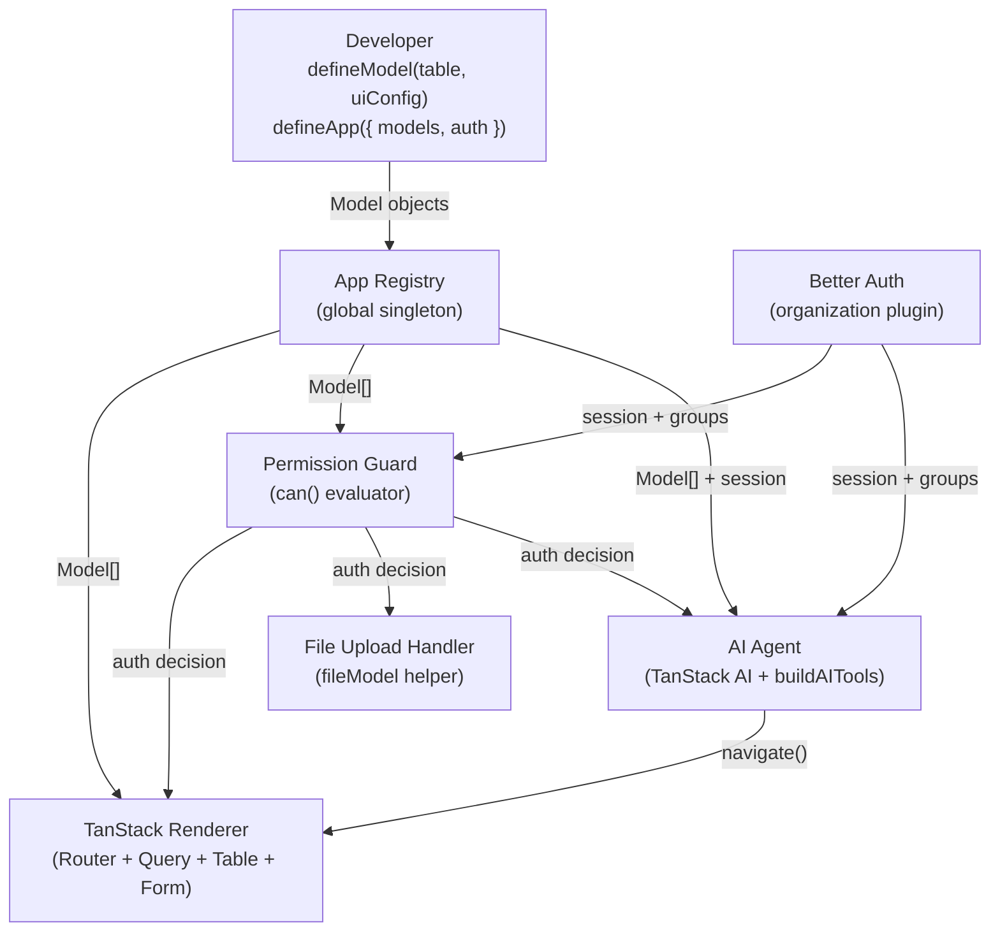

# Design Document: tanstack-use

## Overview

`tanstack-use` is a TypeScript meta-framework that lets developers define a single `defineModel()` call per entity and get a fully functional UI (list, detail, create pages via TanStack Router + TanStack Query + TanStack Table + TanStack Form), group-based permissions via Better Auth, file upload with access control, debounced search via TanStack Pacer, and an auto-generated AI chatbot via TanStack AI — all from one source of truth.

The core design principle is **minimal code**: use Drizzle as-is, use Better Auth as-is, and only add what those libraries cannot provide — the `UIConfig` layer and the TanStack renderer. There is no IR pipeline, no field-kind mapping, no custom auth schema, and no Drizzle mapper. The Drizzle table IS the schema.

### Key Design Decisions

- **Drizzle table as first argument**: `defineModel(table, uiConfig)` — the developer writes the Drizzle table directly. No transformation layer.
- **No IR**: There is no Internal Representation pipeline. The `UIConfig` is read directly by the TanStack renderer.
- **No FieldKind enum**: Drizzle already knows its own column types. The framework never re-encodes them.
- **Layout drives page existence**: A page exists if and only if its corresponding `ui.layout` section (`list`, `detail`, `create`) is defined. No separate `pages` flag.
- **Better Auth for everything auth-related**: Authentication, users, members, and groups are managed entirely by a pre-configured Better Auth instance with the `organization` plugin. The framework generates no auth schema.
- **`fileModel()` helper**: File fields are a text column (storing the path) produced by a `fileModel()` helper. No separate file table abstraction is needed in the model definition.
- **Full typed record everywhere**: `compute`, `format`, `onSubmit`, and hook contexts all receive the full typed record inferred from the Drizzle table.
- **`label` is always a function**: `UIFieldDef.label` is typed as `() => string`. Developers pass a Paraglide message function (e.g. `label: m.employeeName`) or any zero-argument function. This eliminates the `TranslationConfig` block entirely. Static labels are `() => "Full Name"`. The renderer calls `label()` on every render, so locale switches are automatically reflected.
- **TanStack Table for list pages**: Column definitions are derived from `ui.layout.list`. Sorting and filter state live in the URL via TanStack Router search params.
- **TanStack Form for create/edit pages**: Field validators are declared in `ui.fields.validate`. The form tracks dirty state and blocks navigation away from unsaved changes.
- **TanStack Pacer for search debounce**: The search input in list pages uses `useAsyncDebouncer` with a configurable delay (default 300 ms) to avoid firing a query on every keystroke.
- **TanStack Start server functions for all data operations**: A single `createServerFunctions(app, db)` call in `tanstack-use-ui` produces typed server functions for `list`, `get`, `create`, `update`, and `remove`. No REST endpoints, no manual `fetch` calls, no `apiBase` prop. Components access these via `useServerFunctions()` from a React context provider. Developers place breakpoints directly inside their `beforeCreate`/`afterCreate` hooks — the debugger stops there during server function execution.
- **TanStack AI for the chatbot**: `buildAITools(app, session)` derives tool definitions from `app.models` at runtime. The developer passes a TanStack AI adapter — no LLM provider is hard-coded. The chatbot is provider-agnostic by design.
- **AI tools respect permissions**: `buildAITools` calls `can()` for each operation before registering the tool. A session without `create` permission never gets a `createEmployee` tool — the AI cannot attempt what the user cannot do.

---

## Architecture

### High-Level Data Flow



### Package Structure

```
packages/
  tanstack-use-core/        # defineModel, defineApp, type utilities, executeCreate/executeUpdate
  tanstack-use-ui/          # TanStack Renderer (Router + Query + Table + Form + Pacer)
                            # + createServerFunctions, ServerFunctionsProvider, useServerFunctions
  tanstack-use-files/       # fileModel helper, storage adapters
  tanstack-use-permissions/ # Permission guard, can() function
  tanstack-use-ai/          # buildAITools, buildSystemPrompt, ChatBot component
```

Application developers import from `@tanstack-use/core` (for `defineModel`/`defineApp`), `@tanstack-use/ui` (for the router/page factory, server functions, and context provider), and `@tanstack-use/ai` (for the chatbot).

---

## Components and Interfaces

### 1. defineModel() API

```typescript
// @tanstack-use/core/src/define-model.ts

import type { PgTable } from "drizzle-orm/pg-core";
import type { BetterAuthSession } from "better-auth";

/** Infer the record type from a Drizzle PgTable */
export type InferRecord<T extends PgTable> = T["$inferSelect"];

/** All field keys: column keys + computed field keys */
export type AllFieldKeys<
  T extends PgTable,
  TComputed extends Record<string, ComputedFieldDef<T>>
> = keyof T["_"]["columns"] | keyof TComputed;

/** A computed field — compute and format both receive the full typed record */
export interface ComputedFieldDef<T extends PgTable> {
  dependsOn: [keyof T["_"]["columns"], ...(keyof T["_"]["columns"])[]]; // non-empty tuple
  compute: (record: InferRecord<T>) => unknown;
  format?: (record: InferRecord<T>) => string;
}

/** Per-field UI override — format receives the full typed record for context */
export interface UIFieldDef<T extends PgTable> {
  /**
   * Zero-argument function returning the display label.
   * Pass a Paraglide message function (e.g. `label: m.employeeName`) for
   * reactive i18n, or a plain arrow function for static text.
   * Falls back to the field key name when absent.
   */
  label?: () => string;
  format?: (record: InferRecord<T>) => string;
  hidden?: boolean | ((record: InferRecord<T>) => boolean);
  /** TanStack Form field-level validator — runs on change and blur */
  validate?: (value: unknown) => string | undefined;
}

export interface TabDef<
  T extends PgTable,
  TComputed extends Record<string, ComputedFieldDef<T>>
> {
  label: string;
  rows: AllFieldKeys<T, TComputed>[][];
}

/** Options for the generated list page */
export interface ListOptions {
  /** Debounce delay in ms for the search input. Default: 300 */
  searchDebounceMs?: number;
}

export interface LayoutDef<
  T extends PgTable,
  TComputed extends Record<string, ComputedFieldDef<T>>
> {
  list?: AllFieldKeys<T, TComputed>[];    // absent → no list page
  listOptions?: ListOptions;
  detail?: TabDef<T, TComputed>[];        // absent → no detail page
  create?: AllFieldKeys<T, TComputed>[];  // absent → no create page
}

export interface PermissionsDef {
  read?: string[];    // Better Auth group names
  create?: string[];
  update?: string[];
  delete?: string[];
}

export interface ServerHooks<T extends PgTable> {
  beforeCreate?: (ctx: { record: InferRecord<T>; session: BetterAuthSession }) => Promise<void>;
  afterCreate?: (ctx: { record: InferRecord<T>; session: BetterAuthSession }) => Promise<void>;
  beforeUpdate?: (ctx: { record: InferRecord<T>; session: BetterAuthSession }) => Promise<void>;
  afterUpdate?: (ctx: { record: InferRecord<T>; session: BetterAuthSession }) => Promise<void>;
}

export interface ClientHooks<T extends PgTable> {
  onSubmit?: (record: InferRecord<T>) => InferRecord<T> | Promise<InferRecord<T>>;
}

export interface UIConfig<T extends PgTable> {
  fields?: Partial<Record<keyof T["_"]["columns"], UIFieldDef<T>>>;
  computedFields?: Record<string, ComputedFieldDef<T>>;
  layout?: LayoutDef<T, Record<string, ComputedFieldDef<T>>>;
  permissions?: PermissionsDef;
  server?: ServerHooks<T>;
  client?: ClientHooks<T>;
}

export interface Model<T extends PgTable> {
  _tag: "Model";
  table: T;
  ui: UIConfig<T>;
}

export function defineModel<T extends PgTable>(
  table: T,
  ui: UIConfig<T>
): Model<T>;
```

---

### 2. defineApp() API

```typescript
// @tanstack-use/core/src/define-app.ts

import type { BetterAuth } from "better-auth";

export interface AppConfig {
  models: Model<any>[];
  auth: BetterAuth; // pre-configured Better Auth instance with organization plugin
}

export interface App {
  _tag: "App";
  models: Map<string, Model<any>>; // keyed by table name
  auth: BetterAuth;
}

export function defineApp(config: AppConfig): App;
```

`defineApp()` iterates `config.models`, inserts each into the Map keyed by the table's name, and throws `Error("Duplicate model: <name>")` if a key already exists.

---

### 3. fileModel() Helper

```typescript
// @tanstack-use/files/src/file-model.ts

export interface StorageAdapter {
  store(file: File): Promise<string>;
  delete(path: string): Promise<void>;
}

export function localDisk(options?: { dir?: string }): StorageAdapter;
export function s3(options: { bucket: string; region: string }): StorageAdapter;

export interface FileModelConfig {
  storage: StorageAdapter;
  fileAccess?: string[];
}

export interface FileModelColumn {
  column: PgColumn;
  _config: FileModelConfig;
}

export function fileModel(config: FileModelConfig): FileModelColumn;
```

---

## Data Models

### UIConfig Read Path

The TanStack renderer reads `UIConfig` directly — there is no transformation step. The renderer accesses:

- `model.table` — the Drizzle table (for column metadata and query building)
- `model.ui.fields` — per-field `label` / `format` / `hidden` / `validate` overrides
- `model.ui.computedFields` — computed display fields
- `model.ui.layout` — which pages exist and what fields they show
- `model.ui.layout.listOptions` — search debounce config
- `model.ui.permissions` — group-based access rules
- `model.ui.server` / `model.ui.client` — lifecycle hooks

### Record Type Inference

```typescript
const employeeTable = pgTable("employee", {
  id:   serial("id").primaryKey(),
  name: text("name").notNull(),
});

// InferRecord<typeof employeeTable> → { id: number; name: string }
// Flows through to: compute, format, onSubmit, beforeCreate, afterCreate
```

---

## Components and Interfaces (Detailed)

### Permission Guard

```typescript
export async function can(
  session: Session,
  target: string,  // "ModelName.operation"
  app: App
): Promise<boolean>;
```

Algorithm: parse `target`, look up model, check `allowedGroups`. Empty/absent = open. Call `app.auth.api.getActiveMemberGroups(session)` and check intersection.

---

### TanStack Renderer

Routes are registered via `createRoutes(app, rootRoute)` returning real TanStack Router route instances. The developer calls `rootRoute.addChildren(routes)` and registers the router once with `declare module "@tanstack/react-router" { interface Register { router: typeof router } }` to unlock type-safe navigation everywhere.

**List page — TanStack Table + TanStack Query + TanStack Pacer**:

```
<ListPage>:
  const { list } = useServerFunctions()

  // Search debounce via TanStack Pacer
  [searchTerm, setSearchTerm] = useState("")
  debouncedSearch = useAsyncDebouncer(searchTerm, {
    wait: model.ui.layout.listOptions?.searchDebounceMs ?? 300
  })

  // Data fetching via TanStack Query → server function
  data = useQuery({
    queryKey: [tableName, "list", debouncedSearch, sorting, pagination],
    queryFn: () => list({ tableName, search: debouncedSearch, ...sorting, ...pagination })
  })

  // Column definitions derived from ui.layout.list
  columns = model.ui.layout.list.map(col => ({
    accessorKey: col,
    header: () => resolveLabel(col, model),
    cell: ({ row }) =>
      col in computedFields
        ? cf.format ? cf.format(row.original) : String(cf.compute(row.original))
        : uiField?.format ? uiField.format(row.original) : row.original[col]
  }))

  // Sort + pagination state in URL via TanStack Router search params
  table = useReactTable({ data, columns, getCoreRowModel, getSortedRowModel,
                          getPaginationRowModel, state: { sorting, pagination } })

  render:
    <input onChange={setSearchTerm} placeholder="Search..." />
    <table> ... TanStack Table render ... </table>
    <Pagination table={table} />
```

**Create/Edit page — TanStack Form**:

```
<CreatePage>:
  const { create } = useServerFunctions()
  fields = model.ui.layout.create.filter(f => f not in computedFields)

  form = useForm({
    defaultValues: {},
    onSubmit: async ({ value }) => {
      let record = value
      if model.ui.client?.onSubmit:
        record = await model.ui.client.onSubmit(record)
      await create({ tableName, record })
    }
  })

  render <form onSubmit={form.handleSubmit}>
    for each fieldName in fields:
      <form.Field name={fieldName} validators={{ onChange: ui.fields[fieldName]?.validate }}>
        {(field) => <FieldInput field={field} model={model} />}
      </form.Field>
    <SubmitButton disabled={!form.state.canSubmit || form.state.isSubmitting} />
```

**Dirty-state navigation guard**:

```
// In CreatePage / EditPage route definition:
beforeLoad: ({ context }) => {
  if (form.state.isDirty) {
    if (!confirm("You have unsaved changes. Leave anyway?")) throw redirect(...)
  }
}
```

---

### 4. Server Functions Layer

```typescript
// packages/tanstack-use-ui/src/server-functions.ts
"use server";

import { createServerFn } from "@tanstack/react-start";
import { can, AuthorizationError } from "@tanstack-use/permissions";
import { executeCreate, executeUpdate, type DrizzleDb } from "@tanstack-use/core";
import type { App } from "@tanstack-use/core";

export function createServerFunctions(app: App, db: DrizzleDb) {
  const list = createServerFn()
    .validator((d: { tableName: string; search?: string; sortBy?: string; sortDir?: string; page?: number; pageSize?: number }) => d)
    .handler(async ({ data, context }) => {
      const model = app.models.get(data.tableName);
      if (!model) throw new Error(`Unknown model: ${data.tableName}`);
      const session = await app.auth.api.getSession({ headers: context.request.headers });
      if (!await can(session, `${data.tableName}.read`, app)) throw new AuthorizationError();
      // Apply search/sort/pagination to Drizzle query and return records
    });

  const get = createServerFn()
    .validator((d: { tableName: string; id: string | number }) => d)
    .handler(async ({ data, context }) => {
      const model = app.models.get(data.tableName);
      if (!model) throw new Error(`Unknown model: ${data.tableName}`);
      const session = await app.auth.api.getSession({ headers: context.request.headers });
      if (!await can(session, `${data.tableName}.read`, app)) throw new AuthorizationError();
      // Return single record by id or throw not-found
    });

  const create = createServerFn()
    .validator((d: { tableName: string; record: unknown }) => d)
    .handler(async ({ data, context }) => {
      const model = app.models.get(data.tableName);
      if (!model) throw new Error(`Unknown model: ${data.tableName}`);
      const session = await app.auth.api.getSession({ headers: context.request.headers });
      if (!await can(session, `${data.tableName}.create`, app)) throw new AuthorizationError();
      // Delegates to executeCreate — beforeCreate hook → persist → afterCreate hook
      return executeCreate(model, data.record, session, db);
    });

  const update = createServerFn()
    .validator((d: { tableName: string; id: string | number; record: unknown }) => d)
    .handler(async ({ data, context }) => {
      const model = app.models.get(data.tableName);
      if (!model) throw new Error(`Unknown model: ${data.tableName}`);
      const session = await app.auth.api.getSession({ headers: context.request.headers });
      if (!await can(session, `${data.tableName}.update`, app)) throw new AuthorizationError();
      return executeUpdate(model, data.record, session, db);
    });

  const remove = createServerFn()
    .validator((d: { tableName: string; id: string | number }) => d)
    .handler(async ({ data, context }) => {
      const model = app.models.get(data.tableName);
      if (!model) throw new Error(`Unknown model: ${data.tableName}`);
      const session = await app.auth.api.getSession({ headers: context.request.headers });
      if (!await can(session, `${data.tableName}.delete`, app)) throw new AuthorizationError();
      // Delete record via Drizzle
    });

  return { list, get, create, update, remove };
}
```

**Context provider and hook** (`server-functions-context.tsx`):

```typescript
const ServerFunctionsContext = createContext<ReturnType<typeof createServerFunctions> | null>(null);

export function ServerFunctionsProvider({ fns, children }) {
  return <ServerFunctionsContext.Provider value={fns}>{children}</ServerFunctionsContext.Provider>;
}

export function useServerFunctions() {
  const ctx = useContext(ServerFunctionsContext);
  if (!ctx) throw new Error("useServerFunctions must be used inside <ServerFunctionsProvider>");
  return ctx;
}
```

**Developer one-time setup**:

```typescript
// app.tsx or root.tsx
const fns = createServerFunctions(app, db);

<ServerFunctionsProvider fns={fns}>
  <RouterProvider router={router} />
</ServerFunctionsProvider>
```

**Debugging**: Because `beforeCreate`, `afterCreate`, `beforeUpdate`, and `afterUpdate` are plain async functions defined in the developer's own codebase, placing a breakpoint inside them works exactly as expected — the debugger stops there during server function execution with full access to the record and session in scope.

---

### AI Package — tanstack-use-ai

```typescript
// @tanstack-use/ai/src/build-ai-tools.ts

import { toolDefinition } from "@tanstack/ai";
import type { App } from "@tanstack-use/core";
import type { Session } from "better-auth";

/**
 * Derives TanStack AI tool definitions from the App registry.
 * Only generates tools for operations the session's member can perform.
 *
 * Usage:
 *   const tools = await buildAITools(app, session);
 *   const stream = chat({ adapter: openaiText("gpt-4o"), tools, system: buildSystemPrompt(app) });
 */
export async function buildAITools(app: App, session: Session): Promise<Record<string, unknown>>;

/**
 * Generates a natural-language system prompt describing all registered models,
 * their fields, and their permitted operations.
 */
export function buildSystemPrompt(app: App): string;
```

**Tool generation algorithm**:

```
async function buildAITools(app, session, serverFns):
  tools = {}
  for each [tableName, model] of app.models:
    for each operation of ["list", "create", "update", "delete"]:
      permitted = await can(session, `${tableName}.${operation}`, app)
      if permitted:
        tools[`${operation}${capitalize(tableName)}`] = toolDefinition({
          description: `${operation} ${tableName} records`,
          parameters: buildParameterSchema(model, operation),
          execute: buildExecutor(serverFns, tableName, operation),
        })
  return tools
```

**System prompt generation**:

```
function buildSystemPrompt(app):
  lines = ["You are an AI assistant for this application. You have access to the following data:"]
  for each [tableName, model] of app.models:
    fields = Object.keys(model.table._["columns"]).join(", ")
    lines.push(`- ${tableName}: fields [${fields}]`)
    if model.ui.layout?.list: lines.push(`  • Can list ${tableName}`)
    if model.ui.layout?.detail: lines.push(`  • Can view ${tableName} details`)
    if model.ui.layout?.create: lines.push(`  • Can create ${tableName}`)
  return lines.join("\n")
```

**ChatBot component**:

```typescript
// @tanstack-use/ai/src/ChatBot.tsx

interface ChatBotProps {
  app: App;
  session: Session;
  adapter: AnyAdapter; // e.g. openaiText("gpt-4o") — developer-supplied
}

export function ChatBot({ app, session, adapter }: ChatBotProps): JSX.Element;
```

The `ChatBot` component:
1. Calls `buildAITools(app, session)` on mount to get permission-scoped tools
2. Calls `buildSystemPrompt(app)` for the system message
3. Uses TanStack AI's `useChat` hook with the developer-supplied adapter
4. Streams responses; tool calls execute API operations and optionally call `navigate()`
5. Renders a floating chat panel that can be toggled open/closed

---

### Server Lifecycle Hook Execution

```
executeCreate order: beforeCreate → persist → afterCreate
- beforeCreate throws → abort, propagate, no DB write
- afterCreate throws → log, do NOT roll back
```

---

### File Upload Handler

```
handleUpload: check fileAccess groups → store via adapter → return path
handleDelete: check fileAccess groups → delete via adapter
```

---

## Correctness Properties

### Property 1: Layout field references are a subset of valid keys
Every field name in `ui.layout.list/detail/create` must be a column key or `computedField` key.
**Validates: Requirements 2.1, 2.2, 2.3**

### Property 2: Computed field dependsOn references are valid column keys
Every `dependsOn` entry must be a column key of the Drizzle table.
**Validates: Requirements 2.4, 2.5**

### Property 3: format and compute receive the full record
`compute(record)` and `format(record)` produce the same result regardless of how the record was constructed.
**Validates: Requirements 3.5, 7.4**

### Property 4: Permission evaluation is correct for all group combinations
`can()` returns `true` iff allowed groups is empty OR member groups intersect allowed groups.
**Validates: Requirements 5.2, 5.3**

### Property 5: File upload access is consistent with fileAccess config
Upload is permitted iff `fileAccess` is empty OR member groups intersect `fileAccess`.
**Validates: Requirements 6.3, 6.4**

### Property 6: Page existence matches layout presence
A list/detail/create page is generated iff the corresponding `ui.layout` section is defined.
**Validates: Requirements 1.5, 1.6, 1.7, 1.8**

### Property 7: onSubmit transformation is applied before submission
The value submitted to the API equals `onSubmit(record)`, not the original record.
**Validates: Requirements 7.7**

### Property 8: AI tools respect permission boundaries
For any session and any model, `buildAITools` generates a tool for operation X iff `can(session, "model.X", app)` returns `true`.
**Validates: Requirements 13.2, 13.8**

### Property 9: Search debounce fires exactly once per settled input
For any sequence of keystrokes within the debounce window, the search query fires exactly once after the window expires.
**Validates: Requirements 11.3, 11.4**

---

## Error Handling

| Scenario | Behavior |
|---|---|
| `defineModel()` called without a Drizzle table | TypeScript compile-time error |
| Layout references a non-existent field key | TypeScript compile-time error via `AllFieldKeys` |
| `dependsOn` is an empty array | TypeScript compile-time error (non-empty tuple type) |
| `dependsOn` references a non-column key | TypeScript compile-time error via `keyof T["_"]["columns"]` |
| `defineApp()` receives duplicate model table names | Runtime `Error("Duplicate model: <name>")` |
| `can()` called with unknown model name | Runtime `Error("Unknown model: <name>")` |
| `can()` returns `false` on page access | TanStack Router redirect to `/unauthorized` |
| `can()` returns `false` on create/update/delete | `AuthorizationError` thrown (HTTP 403) by server function |
| File upload by unauthorized member | `AuthorizationError` thrown (HTTP 403) |
| `beforeCreate` throws | Create server function aborts, error propagated to caller |
| `afterCreate` throws | Error logged, record NOT rolled back |
| `useServerFunctions()` called outside provider | Runtime error: `"useServerFunctions must be used inside <ServerFunctionsProvider>"` |
| `ui.layout` absent entirely | No pages generated for that model (by design) |
| `label` absent on a field | Falls back to field key name as label |
| Form field fails validation | Error message displayed below field; submit disabled |
| AI tool call for unpermitted operation | Tool not registered; agent receives capability description without that tool |
| AI tool call fails at API level | Error returned to agent as tool result; agent can explain to user |

---

## Testing Strategy

### Approach

- **Unit tests**: Specific behaviors, edge cases, error conditions
- **Property-based tests**: Universal properties via [fast-check](https://fast-check.io), minimum 100 iterations each
- **Component tests**: React Testing Library for UI components

Each property test is tagged:
```typescript
// Feature: tanstack-use, Property N: <description>
```

### Property-Based Test Coverage

| Property | Description | Generators |
|---|---|---|
| P1: Layout field references valid | All layout refs are column or computed keys | `fc.record`, `fc.array`, `fc.constantFrom` |
| P2: dependsOn references valid | All dependsOn entries are column keys | `fc.record`, `fc.array` |
| P3: format/compute receive full record | Output matches direct call with same record | `fc.record` |
| P4: Permission evaluation correct | `can()` matches set-intersection logic | `fc.array(fc.string())` |
| P5: File upload access consistent | Upload permission matches intersection | `fc.array(fc.string())` |
| P6: Page existence matches layout | Routes match defined layout sections | `fc.option(fc.array(...))` |
| P7: onSubmit applied before submission | Submitted value equals `onSubmit(record)` | `fc.record`, `fc.func` |
| P8: AI tools respect permissions | Tool exists iff `can()` returns `true` | `fc.array(fc.string())` |
| P9: Search debounce fires once per window | Query fires once after debounce settles | `fc.array(fc.string())`, fake timers |

### Package-Level Testing

- `tanstack-use-core`: Unit + property tests for `defineModel`, `defineApp`, type inference
- `tanstack-use-permissions`: Unit + property tests for `can()`
- `tanstack-use-files`: Unit + property tests for `fileModel`, upload/delete access control
- `tanstack-use-ui`: Unit + component tests for route generation, label resolution, ListPage (Table + Pacer), CreatePage (Form)
- `tanstack-use-ai`: Unit + property tests for `buildAITools`, `buildSystemPrompt`; component tests for `ChatBot`
