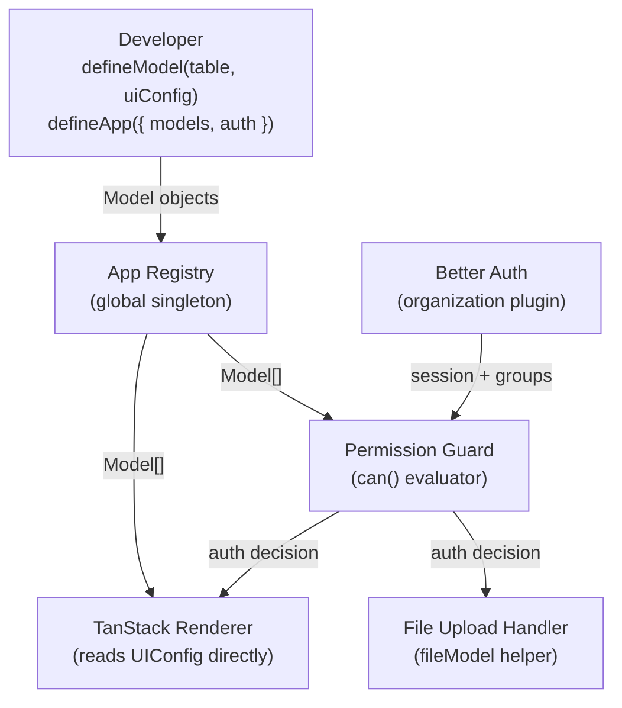

# Design Document: tanstack-use

## Overview

`tanstack-use` is a TypeScript meta-framework that lets developers define a single `defineModel()` call per entity and get a fully functional UI (list, detail, create pages via TanStack Router + TanStack Query), group-based permissions via Better Auth, and file upload with access control — all from one source of truth.

The core design principle is **minimal code**: use Drizzle as-is, use Better Auth as-is, and only add what those libraries cannot provide — the `UIConfig` layer and the TanStack renderer. There is no IR pipeline, no field-kind mapping, no custom auth schema, and no Drizzle mapper. The Drizzle table IS the schema.

### Key Design Decisions

- **Drizzle table as first argument**: `defineModel(table, uiConfig)` — the developer writes the Drizzle table directly. No transformation layer.
- **No IR**: There is no Internal Representation pipeline. The `UIConfig` is read directly by the TanStack renderer.
- **No FieldKind enum**: Drizzle already knows its own column types. The framework never re-encodes them.
- **Layout drives page existence**: A page exists if and only if its corresponding `ui.layout` section (`list`, `detail`, `create`) is defined. No separate `pages` flag.
- **Better Auth for everything auth-related**: Authentication, users, members, and groups are managed entirely by a pre-configured Better Auth instance with the `organization` plugin. The framework generates no auth schema.
- **`fileModel()` helper**: File fields are a text column (storing the path) produced by a `fileModel()` helper. No separate file table abstraction is needed in the model definition.
- **Full typed record everywhere**: `compute`, `format`, `onSubmit`, and hook contexts all receive the full typed record inferred from the Drizzle table.

---

## Architecture

### High-Level Data Flow



### Package Structure

```
packages/
  tanstack-use-core/        # defineModel, defineApp, type utilities
  tanstack-use-ui/          # TanStack Renderer (React components + route factories)
  tanstack-use-files/       # fileModel helper, storage adapters
  tanstack-use-permissions/ # Permission guard, can() function
```

Application developers import from `tanstack-use-core` (for `defineModel`/`defineApp`/`fileModel`) and `tanstack-use-ui` (for the router/page factory).

---

## Components and Interfaces

### 1. defineModel() API

```typescript
// tanstack-use-core/src/define-model.ts

import type { PgTable } from "drizzle-orm/pg-core";
import type { BetterAuthSession } from "better-auth";

/** Infer the record type from a Drizzle PgTable */
export type InferRecord<T extends PgTable> = T["$inferSelect"];

/** All field keys: column keys + computed field keys */
export type AllFieldKeys<
  T extends PgTable,
  TComputed extends Record<string, ComputedFieldDef<T>>
> = keyof T["_"]["columns"] | keyof TComputed;

/** A computed field — compute and format both receive the full typed record */
export interface ComputedFieldDef<T extends PgTable> {
  dependsOn: [keyof T["_"]["columns"], ...(keyof T["_"]["columns"])[]]; // non-empty tuple
  compute: (record: InferRecord<T>) => unknown;
  format?: (record: InferRecord<T>) => string;
}

/** Per-field UI override — format receives the full typed record for context */
export interface UIFieldDef<T extends PgTable> {
  label?: string;
  format?: (record: InferRecord<T>) => string;
  hidden?: boolean | ((record: InferRecord<T>) => boolean);
}

export interface TabDef<
  T extends PgTable,
  TComputed extends Record<string, ComputedFieldDef<T>>
> {
  label: string;
  rows: AllFieldKeys<T, TComputed>[][];
}

export interface LayoutDef<
  T extends PgTable,
  TComputed extends Record<string, ComputedFieldDef<T>>
> {
  list?: AllFieldKeys<T, TComputed>[];    // absent → no list page
  detail?: TabDef<T, TComputed>[];        // absent → no detail page
  create?: AllFieldKeys<T, TComputed>[];  // absent → no create page
}

export interface TranslationConfig {
  fieldLabels?: Record<string, string>;
  pageTitle?: { list?: string; detail?: string; create?: string };
  messages?: Record<string, string>;
}

export interface PermissionsDef {
  read?: string[];    // Better Auth group names
  create?: string[];
  update?: string[];
  delete?: string[];
}

export interface ServerHooks<T extends PgTable> {
  beforeCreate?: (ctx: { record: InferRecord<T>; session: BetterAuthSession }) => Promise<void>;
  afterCreate?: (ctx: { record: InferRecord<T>; session: BetterAuthSession }) => Promise<void>;
  beforeUpdate?: (ctx: { record: InferRecord<T>; session: BetterAuthSession }) => Promise<void>;
  afterUpdate?: (ctx: { record: InferRecord<T>; session: BetterAuthSession }) => Promise<void>;
}

export interface ClientHooks<T extends PgTable> {
  onSubmit?: (record: InferRecord<T>) => InferRecord<T> | Promise<InferRecord<T>>;
}

export interface UIConfig<T extends PgTable> {
  fields?: Partial<Record<keyof T["_"]["columns"], UIFieldDef<T>>>;
  computedFields?: Record<string, ComputedFieldDef<T>>;
  layout?: LayoutDef<T, Record<string, ComputedFieldDef<T>>>;
  translations?: TranslationConfig;
  permissions?: PermissionsDef;
  server?: ServerHooks<T>;
  client?: ClientHooks<T>;
}

export interface Model<T extends PgTable> {
  _tag: "Model";
  table: T;
  ui: UIConfig<T>;
}

export function defineModel<T extends PgTable>(
  table: T,
  ui: UIConfig<T>
): Model<T>;
```

**Compile-time enforcement of `dependsOn` non-empty**: `[keyof T["_"]["columns"], ...(keyof T["_"]["columns"])[]]` is a non-empty tuple — an empty array `[]` does not satisfy it.

**Layout drives page existence**: If `ui.layout.list` is defined, a list page is generated. If absent, no list page. Same for `detail` and `create`.

---

### 2. defineApp() API

```typescript
// tanstack-use-core/src/define-app.ts

import type { BetterAuth } from "better-auth";

export interface AppConfig {
  models: Model<any>[];
  auth: BetterAuth; // pre-configured Better Auth instance with organization plugin
}

export interface App {
  _tag: "App";
  models: Map<string, Model<any>>; // keyed by table name
  auth: BetterAuth;
}

export function defineApp(config: AppConfig): App;
```

`defineApp()` iterates `config.models`, inserts each into the Map keyed by the table's name, and throws `Error("Duplicate model: <name>")` if a key already exists.

Better Auth integration: The framework calls no auth APIs at definition time. All user, member, and group data is managed by the Better Auth instance at request time.

---

### 3. fileModel() Helper

```typescript
// tanstack-use-files/src/file-model.ts

import type { PgColumn } from "drizzle-orm/pg-core";

export interface StorageAdapter {
  store(file: File): Promise<string>;   // returns stored path
  delete(path: string): Promise<void>;
}

export function localDisk(options?: { dir?: string }): StorageAdapter;
export function s3(options: { bucket: string; region: string }): StorageAdapter;

export interface FileModelConfig {
  storage: StorageAdapter;
  fileAccess?: string[]; // Better Auth group names
}

export interface FileModelColumn {
  column: PgColumn; // text column storing the file path
  _config: FileModelConfig;
}

/**
 * Returns a text column (storing the file path) for use in a Drizzle table.
 * Access control is enforced at upload/delete time via fileAccess groups.
 */
export function fileModel(config: FileModelConfig): FileModelColumn;
```

Usage pattern:

```typescript
import { pgTable, serial, text } from "drizzle-orm/pg-core";
import { betterAuth } from "better-auth";
import { organization } from "better-auth/plugins";
import { defineModel, defineApp } from "tanstack-use-core";
import { fileModel, localDisk } from "tanstack-use-files";

const auth = betterAuth({
  emailAndPassword: { enabled: true },
  plugins: [organization()],
});

const avatarFile = fileModel({
  storage: localDisk(),
  fileAccess: ["admin", "hr"],
});

const employeeTable = pgTable("employee", {
  id:     serial("id").primaryKey(),
  name:   text("name").notNull(),
  avatar: avatarFile.column, // text column storing the path
});

const employeeModel = defineModel(employeeTable, {
  layout: {
    list: ["id", "name", "avatar"],
    detail: [{ label: "Info", rows: [["name", "avatar"]] }],
    create: ["name", "avatar"],
  },
  permissions: { read: [], create: ["admin", "hr"] },
});

defineApp({ models: [employeeModel], auth });
```

---

## Data Models

### UIConfig Read Path

The TanStack renderer reads `UIConfig` directly — there is no transformation step. The renderer accesses:

- `model.table` — the Drizzle table (for column metadata and query building)
- `model.ui.fields` — per-field label/format/hidden overrides
- `model.ui.computedFields` — computed display fields
- `model.ui.layout` — which pages exist and what fields they show
- `model.ui.translations` — i18n strings
- `model.ui.permissions` — group-based access rules
- `model.ui.server` / `model.ui.client` — lifecycle hooks

### Record Type Inference

```typescript
// Given:
const employeeTable = pgTable("employee", {
  id:   serial("id").primaryKey(),
  name: text("name").notNull(),
});

// InferRecord<typeof employeeTable> resolves to:
// { id: number; name: string }

// This type flows through to:
// - ComputedFieldDef.compute(record: { id: number; name: string })
// - UIFieldDef.format(record: { id: number; name: string })
// - ServerHooks.beforeCreate({ record: { id: number; name: string }, session })
// - ClientHooks.onSubmit(record: { id: number; name: string })
```

---

## Components and Interfaces (Detailed)

### Permission Guard

```typescript
// tanstack-use-permissions/src/permission-guard.ts

import type { BetterAuth, Session } from "better-auth";

/**
 * Evaluates whether the session's member can perform an operation on a model.
 *
 * @param session - The Better Auth session (contains member + group memberships)
 * @param target  - "ModelName.operation" e.g. "employee.read"
 * @param app     - The App registry
 */
export async function can(
  session: Session,
  target: string,
  app: App
): Promise<boolean>;
```

**Permission evaluation algorithm**:

```
async function can(session, target, app):
  [modelName, operation] = target.split(".")
  model = app.models.get(modelName)
  if model is undefined → throw Error("Unknown model: " + modelName)

  allowedGroups = model.ui.permissions?.[operation] ?? []
  if allowedGroups.length === 0 → return true  // no restriction = open

  memberGroups = await app.auth.api.getActiveMemberGroups(session)
  return memberGroups.some(g => allowedGroups.includes(g))
```

**Empty array means open**: An empty or absent permission array means unrestricted. Developers must explicitly list groups to restrict access.

---

### TanStack Renderer

The renderer generates React route components using TanStack Router's code-based route API. Routes are registered programmatically from the model registry at app startup.

```typescript
// tanstack-use-ui/src/renderer.ts

export function createRoutes(app: App): RouteObject[];
```

**Route generation** (layout-driven):

```
For each Model in app.models:
  tableName = model.table[Symbol.for("drizzle:Name")]
  if model.ui.layout?.list is defined:
    register route: GET /{tableName}
      → <ListPage model={model} app={app} />
  if model.ui.layout?.detail is defined:
    register route: GET /{tableName}/$id
      → <DetailPage model={model} app={app} />
  if model.ui.layout?.create is defined:
    register route: GET /{tableName}/new
      → <CreatePage model={model} app={app} />
```

**Label resolution**:

```
function resolveLabel(fieldName: string, model: Model<any>): string:
  label = model.ui.fields?.[fieldName]?.label
       ?? model.ui.translations?.fieldLabels?.[fieldName]
       ?? fieldName   // fallback to key name
```

**List page rendering**:

```
<ListPage>:
  columns = model.ui.layout.list   // non-null (route only registered if defined)
  data = useQuery(fetchAll(tableName))
  render <table>:
    header: columns.map(col → <th>{resolveLabel(col, model)}</th>)
    rows: data.map(row →
      <tr> columns.map(col →
        if col in model.ui.computedFields:
          cf = model.ui.computedFields[col]
          render cf.format ? cf.format(row) : String(cf.compute(row))
        else:
          uiField = model.ui.fields?.[col]
          render uiField?.format ? uiField.format(row) : row[col]
      )
    )
```

**Detail page rendering**:

```
<DetailPage>:
  data = useQuery(fetchOne(tableName, params.id))
  render tabs from model.ui.layout.detail:
    for each tab:
      render <Tab label={tab.label}>
        for each row in tab.rows:
          render <Row>
            for each fieldName in row:
              render <FieldDisplay fieldName={fieldName} record={data} model={model} />
```

**Create page rendering**:

```
<CreatePage>:
  fields = model.ui.layout.create
           .filter(f => f not in model.ui.computedFields)
  render <form onSubmit={handleSubmit}>
    for each fieldName in fields:
      render <FieldInput fieldName={fieldName} model={model} />
    render <SubmitButton />
```

**handleSubmit flow**:

```
async function handleSubmit(record):
  if model.ui.client?.onSubmit:
    record = await model.ui.client.onSubmit(record)
  POST /api/{tableName} with record
```

---

### Server Lifecycle Hook Execution

```
async function executeCreate(model, record, session):
  hooks = model.ui.server

  // Step 1: beforeCreate
  if hooks?.beforeCreate:
    await hooks.beforeCreate({ record, session })
    // throws → abort, propagate error, no DB write

  // Step 2: persist
  persisted = await db.insert(model.table).values(record).returning()

  // Step 3: afterCreate
  if hooks?.afterCreate:
    try:
      await hooks.afterCreate({ record: persisted, session })
    catch err:
      logger.error("afterCreate failed", err)
      // do NOT roll back — record is already persisted

  return persisted
```

Execution order: `beforeCreate` → persist → `afterCreate`. An error in `beforeCreate` aborts the operation. An error in `afterCreate` is logged but does not roll back.

---

### File Upload Handler

```typescript
// tanstack-use-files/src/file-handler.ts

export async function handleUpload(
  req: { session: Session; fileModelColumn: FileModelColumn; file: File },
  app: App
): Promise<string>; // returns stored path

export async function handleDelete(
  req: { session: Session; fileModelColumn: FileModelColumn; path: string },
  app: App
): Promise<void>;
```

**Upload flow**:

```
async function handleUpload(req, app):
  allowedGroups = req.fileModelColumn._config.fileAccess ?? []
  if allowedGroups.length > 0:
    memberGroups = await app.auth.api.getActiveMemberGroups(req.session)
    if !memberGroups.some(g => allowedGroups.includes(g)):
      throw AuthorizationError("Upload not permitted")

  path = await req.fileModelColumn._config.storage.store(req.file)
  return path   // caller persists path to the text column
```

---

## Correctness Properties

*A property is a characteristic or behavior that should hold true across all valid executions of a system — essentially, a formal statement about what the system should do. Properties serve as the bridge between human-readable specifications and machine-verifiable correctness guarantees.*

### Property 1: Layout field references are a subset of valid keys

*For any* `UIConfig` and Drizzle table, every field name referenced in `ui.layout.list`, `ui.layout.detail`, and `ui.layout.create` must be either a column key of the table or a key of `ui.computedFields`.

**Validates: Requirements 2.1, 2.2, 2.3**

### Property 2: Computed field dependsOn references are valid column keys

*For any* computed field definition, every entry in `dependsOn` must be a column key of the Drizzle table passed to `defineModel()`.

**Validates: Requirements 2.4, 2.5**

### Property 3: format and compute receive the full record

*For any* model and any record of the inferred type, calling `compute(record)` or `format(record)` with a full record produces the same result as calling it with an equivalent record constructed from the same column values.

**Validates: Requirements 3.5, 7.4**

### Property 4: Permission evaluation is correct for all group combinations

*For any* permission config and any member group list, `can()` returns `true` if and only if the allowed groups list is empty OR the member's groups intersect the allowed groups list.

**Validates: Requirements 5.2, 5.3**

### Property 5: File upload access is consistent with fileAccess config

*For any* `fileModel()` config and any member group list, upload is permitted if and only if `fileAccess` is empty OR the member's groups intersect `fileAccess`.

**Validates: Requirements 6.3, 6.4**

### Property 6: Page existence matches layout presence

*For any* model, a list/detail/create page is generated if and only if the corresponding `ui.layout` section is defined (non-absent).

**Validates: Requirements 1.5, 1.6, 1.7, 1.8**

### Property 7: onSubmit transformation is applied before submission

*For any* model with a `client.onSubmit` hook and any record, the value submitted to the API is the result of `onSubmit(record)`, not the original record.

**Validates: Requirements 7.7**

---

## Error Handling

| Scenario | Behavior |
|---|---|
| `defineModel()` called without a Drizzle table | TypeScript compile-time error (required argument) |
| Layout references a non-existent field key | TypeScript compile-time error via `AllFieldKeys` |
| `dependsOn` is an empty array | TypeScript compile-time error (non-empty tuple type) |
| `dependsOn` references a non-column key | TypeScript compile-time error via `keyof T["_"]["columns"]` |
| `defineApp()` receives duplicate model table names | Runtime `Error("Duplicate model: <name>")` |
| `can()` called with unknown model name | Runtime `Error("Unknown model: <name>")` |
| `can()` returns `false` on page access | TanStack Router redirect to `/unauthorized` |
| `can()` returns `false` on create/update/delete | `AuthorizationError` thrown (HTTP 403) |
| File upload by unauthorized member | `AuthorizationError` thrown (HTTP 403) |
| `beforeCreate` throws | Create operation aborted, error propagated to caller |
| `afterCreate` throws | Error logged, record NOT rolled back |
| `ui.layout` absent entirely | No pages generated for that model (by design) |
| Active locale key absent from `translations` | Falls back to field key name as label |

---

## Testing Strategy

### Approach

The framework uses a dual testing approach:

- **Unit tests**: Verify specific behaviors, edge cases, and error conditions with concrete examples
- **Property-based tests**: Verify universal properties across many generated inputs using [fast-check](https://fast-check.io)

Property tests run a minimum of 100 iterations each. Each property test is tagged with a comment referencing the design property it validates:

```typescript
// Feature: tanstack-use, Property 4: Permission evaluation is correct for all group combinations
```

### Unit Test Coverage

- `defineModel()` with valid table and UIConfig returns a typed Model
- Layout referencing a non-existent field key produces a TypeScript error (compile-time test via `tsd` or `expect-type`)
- Computed fields are excluded from create form field lists
- `can()` returns `false` for a member with no matching group
- `can()` returns `true` for a member with a matching group
- `can()` returns `true` when the permission array is empty
- File upload rejected when member groups don't intersect `fileAccess`
- File upload accepted when member groups intersect `fileAccess`
- No list/detail/create route registered when corresponding layout section is absent
- Translated labels rendered when locale matches `translations.fieldLabels`
- `beforeCreate` error aborts create; record not persisted
- `afterCreate` error logged; record not rolled back

### Property-Based Test Coverage

Each property from the Correctness Properties section maps to one property-based test:

| Property | Test Description | fast-check Generators |
|---|---|---|
| P1: Layout field references valid | Generate random table columns + UIConfig layouts; assert all refs are valid keys | `fc.record`, `fc.array`, `fc.constantFrom` |
| P2: dependsOn references valid | Generate random column maps + computed fields; assert all dependsOn entries are column keys | `fc.record`, `fc.array` |
| P3: format/compute receive full record | Generate random records; call format/compute; assert output matches direct call | `fc.record` |
| P4: Permission evaluation correct | Generate random group lists + permission configs; assert `can()` result matches set-intersection logic | `fc.array(fc.string())` |
| P5: File upload access consistent | Generate random fileAccess configs + member groups; assert upload permission matches intersection | `fc.array(fc.string())` |
| P6: Page existence matches layout | Generate random UIConfig with present/absent layout sections; assert routes match | `fc.option(fc.array(...))` |
| P7: onSubmit applied before submission | Generate random records + transform functions; assert submitted value equals `onSubmit(record)` | `fc.record`, `fc.func` |

### Package-Level Testing

- `tanstack-use-core`: Unit + property tests for `defineModel`, `defineApp`, type inference
- `tanstack-use-permissions`: Unit + property tests for `can()`
- `tanstack-use-files`: Unit + property tests for `fileModel`, upload/delete access control
- `tanstack-use-ui`: Unit tests for route generation, label resolution, form field filtering; React Testing Library for component rendering
