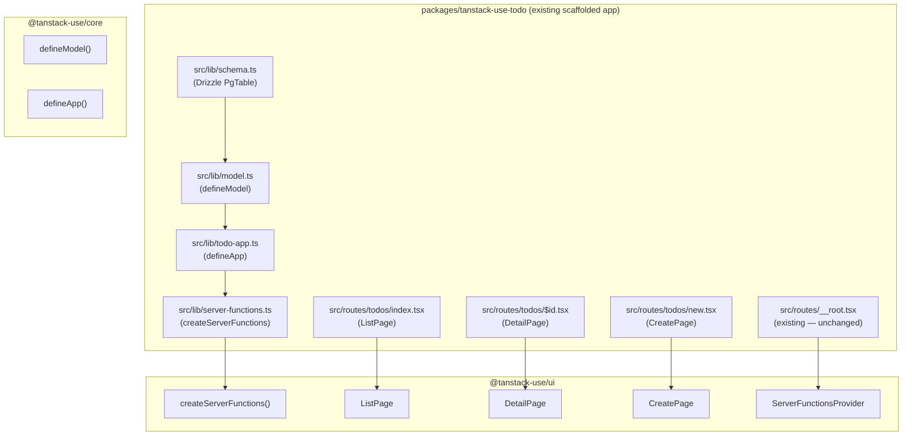

# Design Document: tanstack-use-todo

## Overview

`packages/tanstack-use-todo` is a real TanStack Start application scaffolded with the official CLI. It already has Better Auth, TanStack Router (file-based routing), Tailwind CSS, Vite, and a working dev server. The goal is to **adapt** this existing app to use the tanstack-use framework for the todo feature — adding a Drizzle schema, a `defineModel` definition, a `defineApp` registration, and wiring the auto-generated `ListPage`, `DetailPage`, and `CreatePage` components into the existing file-based route tree.

The app uses **file-based routing** (TanStack Router plugin generates `routeTree.gen.ts` automatically). New todo routes are added as files under `src/routes/todos/`. The existing `src/router.tsx`, `src/lib/auth.ts`, and `src/routes/__root.tsx` are kept as-is.

The package is managed with **pnpm**. The existing `package-lock.json` (npm) is deleted and replaced with pnpm. The package is added to the root `pnpm-workspace.yaml`.

---

## Architecture



**Data flow for creating a todo:**

1. User navigates to `/todos/new` — the `CreatePage` component renders a form with a `title` field.
2. User submits the form; `CreatePage` calls the `create` server function with `{ tableName: "todos", record: { title }, session }`.
3. The `beforeCreate` hook sets `record.userId = session.userId` before the Drizzle insert.
4. On success, the router navigates to `/todos`.

**Data flow for listing todos:**

1. User navigates to `/todos` — the `ListPage` component calls the `list` server function.
2. The `list` handler resolves the session from the request context and filters by `userId`.
3. Only the authenticated user's todos are returned and rendered.

---

## Components and Interfaces

### `src/lib/schema.ts`

New file. Defines the Drizzle `pgTable` for todos.

```typescript
import { pgTable, serial, text, boolean, timestamp } from "drizzle-orm/pg-core";

export const todosTable = pgTable("todos", {
  id:        serial("id").primaryKey(),
  title:     text("title").notNull(),
  completed: boolean("completed").notNull().default(false),
  userId:    text("user_id").notNull(),
  createdAt: timestamp("created_at").notNull().defaultNow(),
});
```

### `src/lib/model.ts`

New file. Wraps `todosTable` with UI configuration via `defineModel`.

```typescript
import { defineModel } from "@tanstack-use/core";
import { todosTable } from "./schema.js";

export const todoModel = defineModel(todosTable, {
  fields: {
    title:     { label: () => "Title", validate: (v) => (!v || String(v).trim() === "" ? "Title is required" : undefined) },
    completed: { label: () => "Completed" },
    createdAt: { label: () => "Created At" },
  },
  layout: {
    list:   ["title", "completed"],
    detail: [{ label: "Details", rows: [["title"], ["completed"], ["createdAt"]] }],
    create: ["title"],
  },
  server: {
    beforeCreate: async ({ record, session }) => {
      (record as Record<string, unknown>).userId = session.userId;
    },
  },
});
```

### `src/lib/todo-app.ts`

New file. Registers `todoModel` with the existing Better Auth instance from `src/lib/auth.ts`.

```typescript
import { defineApp } from "@tanstack-use/core";
import { auth } from "./auth.js";
import { todoModel } from "./model.js";

// auth from better-auth satisfies BetterAuthInstance structurally
export const todoApp = defineApp({ models: [todoModel], auth: auth as any });
```

### `src/lib/server-functions.ts`

New file. Creates the CRUD server functions. Requires a Drizzle DB instance — the app uses a SQLite/LibSQL or Postgres DB configured separately.

```typescript
"use server";
import { createServerFunctions } from "@tanstack-use/ui";
import { todoApp } from "./todo-app.js";
import { db } from "./db.js";

export const todoServerFunctions = createServerFunctions(todoApp, db);
```

### `src/lib/db.ts`

New file. Drizzle database connection. Uses the same DB adapter as Better Auth (SQLite via `better-auth`'s built-in adapter for development, or Postgres for production).

### `src/routes/todos/index.tsx`

New file. List route — renders `ListPage` from `@tanstack-use/ui`.

```typescript
import { createFileRoute } from "@tanstack/react-router";
import { ListPage } from "@tanstack-use/ui";
import { todoModel } from "#/lib/model";

export const Route = createFileRoute("/todos/")({
  component: () => <ListPage model={todoModel} />,
});
```

### `src/routes/todos/new.tsx`

New file. Create route — renders `CreatePage`.

```typescript
import { createFileRoute } from "@tanstack/react-router";
import { CreatePage } from "@tanstack-use/ui";
import { todoModel } from "#/lib/model";

export const Route = createFileRoute("/todos/new")({
  component: () => <CreatePage model={todoModel} />,
});
```

### `src/routes/todos/$id.tsx`

New file. Detail route — renders `DetailPage`.

```typescript
import { createFileRoute } from "@tanstack/react-router";
import { DetailPage } from "@tanstack-use/ui";
import { todoModel } from "#/lib/model";

export const Route = createFileRoute("/todos/$id")({
  component: () => <DetailPage model={todoModel} />,
});
```

### `src/routes/__root.tsx` (modified)

Wrap the existing root with `ServerFunctionsProvider` so all todo pages can access the server functions via context.

```typescript
// Add to existing imports:
import { ServerFunctionsProvider } from "@tanstack-use/ui";
import { todoServerFunctions } from "#/lib/server-functions";

// Wrap children in RootDocument:
<ServerFunctionsProvider fns={todoServerFunctions}>
  {children}
</ServerFunctionsProvider>
```

---

## Data Models

### `todos` table

| Column      | Drizzle type  | Constraints               |
|-------------|---------------|---------------------------|
| `id`        | `serial`      | Primary key, auto-increment |
| `title`     | `text`        | Not null                  |
| `completed` | `boolean`     | Not null, default `false` |
| `userId`    | `text`        | Not null                  |
| `createdAt` | `timestamp`   | Not null, default `now()` |

### User isolation invariant

Every `Todo` record satisfies `todo.userId === session.userId` for the session that created it. Enforced by the `beforeCreate` hook running server-side inside `executeCreate` before the Drizzle insert.

---

## Package Migration: npm → pnpm

The scaffolded app was created with npm (has `package-lock.json` and a local `node_modules`). To integrate it into the pnpm monorepo:

1. Delete `packages/tanstack-use-todo/package-lock.json`
2. Delete `packages/tanstack-use-todo/node_modules`
3. Add `"packages/tanstack-use-todo"` to root `pnpm-workspace.yaml`
4. Add `@tanstack-use/core` and `@tanstack-use/ui` as `workspace:*` dependencies in the app's `package.json`
5. Add `drizzle-orm` to the app's `package.json` dependencies
6. Run `pnpm install` from the workspace root to hoist and link everything

The app's existing `package.json` name should be updated from `"todo"` to `"@tanstack-use/todo"` for consistency.

---

## Error Handling

- **Authorization**: `createServerFunctions` calls `can(session, "todos.create", app)` before persisting. Throws `AuthorizationError` if the session lacks permission.
- **Validation**: `fields.title.validate` blocks form submission for empty/whitespace-only titles via TanStack Form.
- **Not found**: If `get` is called with a non-existent `id`, the server function throws. The `DetailPage` should be wrapped in an error boundary or use TanStack Router's `notFound()` helper.
- **Hook errors**: If `beforeCreate` throws, the insert is aborted and the error propagates to the client.

---

## Package Structure (after adaptation)

```
packages/tanstack-use-todo/
├── package.json          (updated: name, add workspace deps, remove package-lock)
├── tsconfig.json         (existing — unchanged)
├── vite.config.ts        (existing — unchanged)
├── public/               (existing — unchanged)
└── src/
    ├── styles.css        (existing — unchanged)
    ├── router.tsx        (existing — unchanged)
    ├── routeTree.gen.ts  (auto-generated by TanStack Router plugin)
    ├── lib/
    │   ├── auth.ts       (existing — unchanged)
    │   ├── auth-client.ts(existing — unchanged)
    │   ├── db.ts         (NEW — Drizzle DB connection)
    │   ├── schema.ts     (NEW — todosTable)
    │   ├── model.ts      (NEW — todoModel via defineModel)
    │   ├── todo-app.ts   (NEW — todoApp via defineApp)
    │   └── server-functions.ts (NEW — todoServerFunctions)
    ├── components/       (existing — unchanged)
    ├── integrations/     (existing — unchanged)
    └── routes/
        ├── __root.tsx    (MODIFIED — add ServerFunctionsProvider)
        ├── index.tsx     (existing — unchanged)
        ├── about.tsx     (existing — unchanged)
        ├── api/          (existing — unchanged)
        ├── demo/         (existing — unchanged)
        └── todos/
            ├── index.tsx (NEW — ListPage)
            ├── new.tsx   (NEW — CreatePage)
            └── $id.tsx   (NEW — DetailPage)
```
